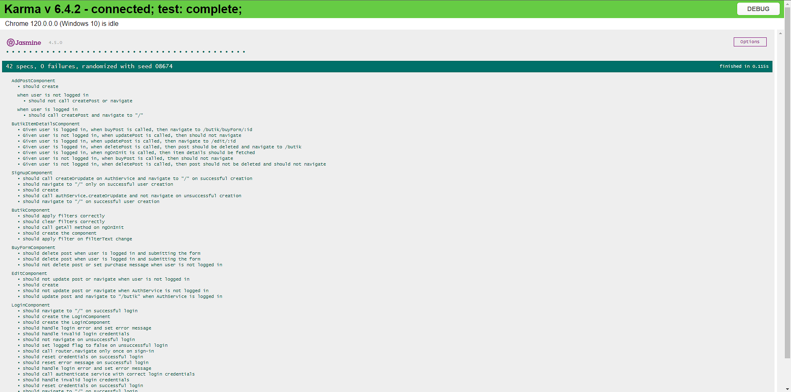
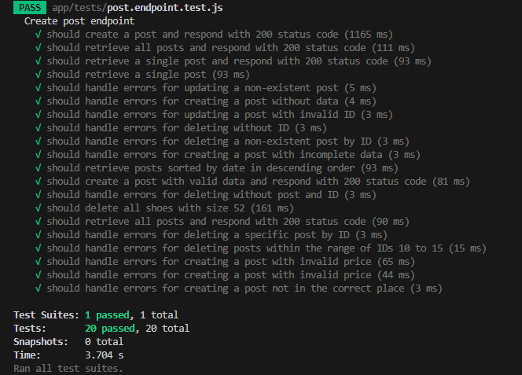

# Butik

## Opis Projektu
Projekt **Testowanie i Jakość Oprogramowania** jest realizowany przez zespół składający się z:

| Index  | Student        | 
|--------|----------------|
| 34326  | Daniel Sikora  | 
| 34275  | Adrain Ciochoń |

## Temat projektu:
**Testowanie aplikacji butik.**
## Opis projektu:

Aplikacja Butik to platforma umożliwiająca użytkownikom zakupy, publikowanie postów oraz interakcję w wirtualnym środowisku sklepowym.

Logowanie i Rejestracja:
Użytkownicy mają możliwość tworzenia konta i logowania się.

Stawianie Postów:
Zarejestrowani użytkownicy mogą dodawać posty, prezentujące buty wraz z opisem, który ma zachęcić użytkowników du zakupu produktu. Zawiera również cene oraz inne informacje na temat produktu.

Edycja postów:
Istnieje możliwość edycji, umożliwiajac aktualizację informacji, zdjęć czy cen.

Filtrowanie:
Użytkownicy mają dostęp do funkcji filtrowania, co umożliwia szybkie znalezienie interesujących produktów.
Filtrowanie dostępne jest po nazwie produktu,cenie oraz rozmiarze butów, co ułatwia precyzyjne wyszukiwanie.
## Uruchomienie projektu:
### Uruchomienie Api:
```cd Api```

```npm start```

Api jest dostępne pod adresem:```http://localhost:3001```
### Uruchomienie Aplikacji:
```cd butik```

```ng serve```

Aplikacja jest dostępna pod adresem:```http://localhost:4200```
### Uruchomienie testów jednostkowych:
```cd butik```

```ng test```

Wyniki testów odpalają się domyślnie w przeglądarce chrome:


### Uruchomienie testów integracyjnych:
```cd Api```

```npm test```


## Scenariusze:

| Test Case ID | Opis                                                           | Kroki testowe                                                                                                                 | Oczekiwany wynik                                                                    |
|-------------|----------------------------------------------------------------|-------------------------------------------------------------------------------------------------------------------------------|-------------------------------------------------------------------------------------|
| TC_01       | Wejście na stronie /addPosts nie będąc zalogowanym.            | 1. Przy uruchomieniu aplikacji dopisz do linku /addPosts                                                                      | Strona nie zostanie przekierowana na podaną, ponieważ warunki nie zostału spełnione |
| TC_02       | Podanie niewłaściwych danych logowania.                        | 1. Kliknięcie w ikonkę w prawym górnym rogu "Zaloguj".<br/>2. Wpisanie niewłaściwych danych logowania.                        | Wyskoczy komunikat "Wystąpił błąd podczas logowania.                                |
| TC_03       | Próba rejestracji konta wpisując 2 różne hasła.                | 1. Kliknięcie w ikonkę w prawym górnym rogu "Zarejestruj".<br/> 2. Stwórz konto próbując wpisać błędnie potwierdzające hasło. | Konto użytkownika nie zostanie utworzone.                                           |
| TC_04       | Próba poprawnego zalogowania.                                  | 1. Podanie prawidłowych danych na ekranie logowania.<br/> 2. Kliknięcie przycisku "zaloguj".                                  | Użykownik zostanie zalogowany                                                       |
| TC_05       | Próba rejestracji konta.                                       | 1. Kliknięcie w ikonkę w prawym górnym rogi "Zarejestruj".<br/> 2. Wpisanie poprawnie danych                                  | Użytkownik zostanie utworzony                                                       |
| TC_06       | Dodanie ogłoszenia.                                            | 1. Zalogowanie się na konto.<br/> 2. Wejście w zakłądke "Dodaj ogłoszenie".<br/> 3. Wypełnienie danych.                       | Post zostanie utworzony.                                                            |
| TC_07       | Próba wpisania przy tworzenie ogłoszenia liter w rubryce cena. | 1. Zalogowanie się na konto.<br/> 2. Wejście w zakładkę "Dodaj ogłoszenie".<br/> 3. Próba wpisania liter w rubryce ogłoszenia | Nie jest możliwe wpisanie                                                           |
| TC_08       | Testowanie poprawnego działa czyszczenie filtru.               | 1. Wejście w ogłoszenia.<br/> 2. Wypełnienie rubryk danymi. 3.<br/> Kliknięcie przycisku "Wyczyść filtry"                     | Rubryki z danymi zostaną wyczyszczone.                                              |
| TC_09       | Zakupienie butów.                                              | 1. Wejście w ogłoszenia.<br/> 2. Wybranie butów.<br/> 3. Kliknięcie przycisku "zakup"                                         | Post zostanie usunięty z ogłoszeń                                                   |
| TC_10       | Edytowanie danych z ogłoszeń                                   | 1. Wybranie ogłoszenia.<br/> 2. Kliknięcie przycisk "Edytuj".<br/> 3. Zmiana danych. Potwierdzając przyciskiem aktualizuj.    | Konto użytkownika nie zostanie utworzone.                                           |
| TC_11       | Wejście na stronie /butik nie będąc zalogowanym            | 1. Przy uruchomieniu aplikacji dopisz do linku /butik                                                                     | Strona nie zostanie przekierowana na podaną, ponieważ warunki nie zostału spełnione |
| TC_12       | Filtrowanie danych po cenie                       | 1. Zalogowanie się. <br/>2. Wejście w ogłoszenia. <br/>3. Podanie minimalnej i maksymalnej ceny.                        | Wyświetlą się ogłoszenia w danym zakresie                                |
| TC_13       | Filtrowanie danych po rozmiarze                | 1. Zalogowanie się. <br/>2. Wejście w ogłoszenia. <br/>3. Podanie docelowego rozmiaru buta | Wyświetlą się ogłoszenia o podanym rozmiarze                                           |
| TC_14       | Wylogowanie z użytkownika                                  | 1. Zalogowanie się. <br/>2. Naciśnięcie przycisku "Wyloguj".                                  | Użytkownik zostanie wylogowany.                                                      |
| TC_15       | Filtrowanie danych po nazwie                                       | 1. Zalogowanie się. <br/>2. Wejście w ogłoszenia. 3. Podanie docelowej nazwy                                  | Wyświetlą się ogłoszenia o podanej nazwie                                                      |
| TC_16       | Zmiana zdjęcia dla ogłoszenia                                           | 1. Wybranie ogłoszenia.<br/>2 Kliknięcie przycisk "Edytuj". <br/>3. Zmiana linku dla ogłoszenia                       | Zmiana wyświetlanego zdjęcia                                                            |
| TC_17       | Zmiana ceny dla ogłoszenia | 1. Wybranie ogłoszenia.<br/>2 Kliknięcie przycisk "Edytuj". <br/>3. Zmiana ceny dla ogłoszenia | Zmiana wyświetlanej ceny                                                          |
| TC_18       | Zmiana tytułu dla ogłoszenia               | 1. Wybranie ogłoszenia. <br/>2 Kliknięcie przycisk "Edytuj". <br/>3. Zmiana nazwy dla ogłoszenia                     | Zmiana wyświetlanej nazwy                                             |
| TC_19       | Zmiana opisu dla ogłoszenia                                             | 1. Wybranie ogłoszenia.<br/>2 Kliknięcie przycisk "Edytuj". <br/>3. Zmiana opisu dla ogłoszenia.                                         | Zmiana opisu dla ogłoszenia                                                   |
| TC_20       | Zmiana rozmiaru butów dla ogłoszenia                                 | 1. Wybranie ogłoszenia.<br/>2 Kliknięcie przycisk "Edytuj". <br/>3. Zmiana rozmiaru dla ogłoszenia.    | Zmiana rozmiaru butów dla ogłoszenia                                          |


## Technologie użyte w projekcie:
* ###   JavaScript
* ###  Typescript
* ###  Angular
* ###  Node.js
* ###  HTML
* ###  CSS
* ###  RxJS
* ###  Jest
* ###  Jasmin


